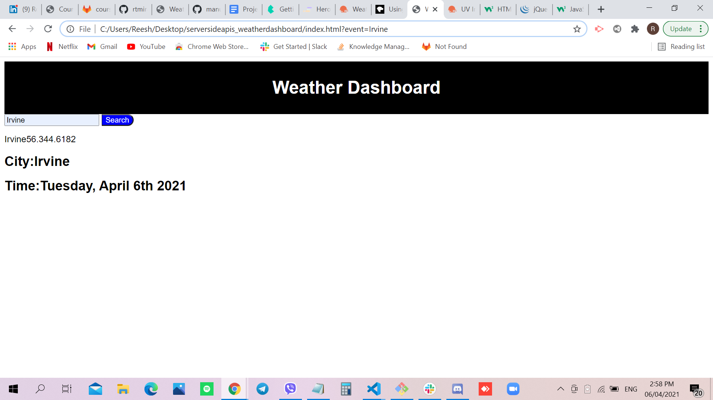

# Weather Dashboard

## Site Picture


## Technologies Used
- HTML - creates elements on the DOM
- CSS - adds style to html elements
- Javascript - adds special effects on pages
- JQuery - library for Javascript
- GitBash - for cloning repository and pushing code to GitHub
- GitHub - holds repository that deploys to GitHub Pages

## Summary
This file contains the webpage for the Weather Dashboard. It also contains code that was created using HTML, CSS, Jquery and Javascript. 

## Code Snippet
```html
search.addEventListener("submit", function(event) {
event.preventDefault();
fetch('https://api.openweathermap.org/data/2.5/weather?q='+input.value+'&units=imperial&appid=82a1cdbfc5805679db4bf205d606147c')
  .then(response => response.json())
  .then(function (data) {
     displayBox.textContent=data.name + data.main.temp + data.wind.speed + data.main.humidity;
     var cityName = document.querySelector(".cityName");
     var cityTime = document.querySelector(".cityTime");
     var time = moment().format("dddd, MMMM Do YYYY");
     cityName.innerHTML = input.value;
     cityTime.innerHTML = time;
    });
if (!searchHistory.includes(input.value)){
  searchHistory.push(input.value);
};

localStorage.setItem("event", JSON.stringify(searchHistory));

console.log(searchHistory);
});
```

```html
<html>

</html>
```

## Author Links 
[LinkedIn](https://www.linkedin.com/in/rosario-miranda-b81170132/)
[GitHub](https://github.com/rtmiranda18)
